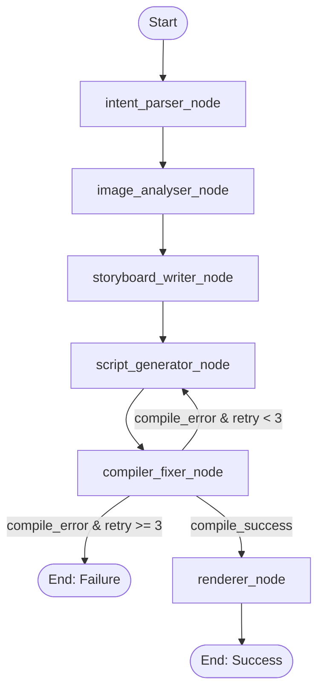

# Foto Owl Assignment: AI Video Generator Agent

This project implements an autonomous AI agent using **LangGraph** and **Remotion** to generate dynamic videos from a simple text prompt and a directory of images.

## Setup and Run Instructions

### Prerequisites
- Python 3.9+
- Node.js & npm (for Remotion rendering)
- A Groq API Key

### Installation

1. **Install Python dependencies:**
   ```bash
   pip3 install -r requirements.txt
   ```

2. **Install Node dependencies for Remotion:**
   ```bash
   cd remotion
   npm install
   cd ..
   ```

3. **Set up Environment Variables:**
   Create a `.env` file in the root directory and add your Groq API key:
   ```env
   GROQ_API_KEY=your_api_key_here
   ```

### Running the Agent
Simply run the main pipeline script. It will generate sample placeholder images, process the prompt, generate a TSX script, compile, and render the final `.mp4` video.
```bash
python3 main.py
```
Check the `output/` directory for the final video and `sample_output/` for the intermediate JSON traces.

---

## LangGraph Graph Diagram

The agent's workflow is orchestrated using LangGraph, featuring a self-healing loop for compiler errors:



---

## Model Selection Rationale

The project leverages Groq's fast inference with two specific LLaMA models, chosen based on node complexity:

- **`llama-3.1-8b-instant`**: Used in the `intent_parser_node`. This node strictly maps user inputs to a Pydantic `VideoIntent` model. Since this is a straightforward structured output task, the smaller, ultra-fast 8B model is perfectly capable and highly cost-effective.
- **`llama-3.3-70b-versatile`**: Used in complex reasoning nodes like `storyboard_writer_node` and `script_generator_node`. Generating syntactically correct React/Remotion code and creative storyboards requires a higher parameter count to understand nuanced RAG context and avoid logical errors.

---

## RAG Design Decisions

To prevent the LLM from hallucinating Remotion APIs or deviating from brand guidelines, we implemented a Retrieval-Augmented Generation (RAG) system:

- **Collections**: We separate knowledge into distinct ChromaDB collections (`style_guides` and `remotion_snippets`). This allows targeted retrieval based on the node's specific needs (e.g., the script generator only queries the API snippets).
- **Chunking Strategy**: We use Langchain's `MarkdownHeaderTextSplitter` splitting on `#` (Header 1). This ensures that chunks are grouped logically by complete API features or style rules, rather than arbitrary character limits which could break code blocks in half.
- **Retrieval Approach**: We use `all-MiniLM-L6-v2` (via HuggingFaceEmbeddings) for fast, local embedding generation. We keep the retrieval `k` small (`k=2` for styles, `k=3` for API) to inject highly relevant, dense context into the system prompt without overwhelming the LLM's context window.

---

## Known Limitations & Future Improvements

If given more time, here are things I would do differently or improve:

1. **Real Vision Model Integration**: The `image_analyser_node` currently uses a mocked output. In a production environment, I would pass the image bytes to GPT-4o or LLaVA to extract actual visual descriptions and quality scores to make smarter scene selections.
2. **Smarter Error Fixing**: When the `compiler_fixer_node` catches a TypeScript error, it sends the error back to the script generator, which rewrites the *entire* file. A better approach would be prompting the LLM to output precise unified diffs or JSON patches to fix only the broken lines, saving tokens and time.
3. **Audio & Voiceovers**: The current Remotion template relies heavily on images and text. I would integrate an agentic step that calls a TTS service (like ElevenLabs) and syncs the audio duration to the generated `durationInFrames` in Remotion using `Audio` components.
4. **Agentic RAG queries**: The script generator hardcodes the RAG query (`"Remotion Composition Sequence Img interpolate"`). With more time, the agent should dynamically generate search queries based on the generated storyboard's transition/animation needs before writing code.